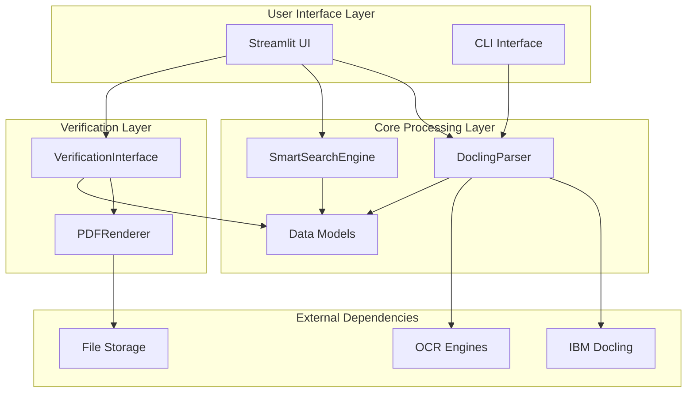
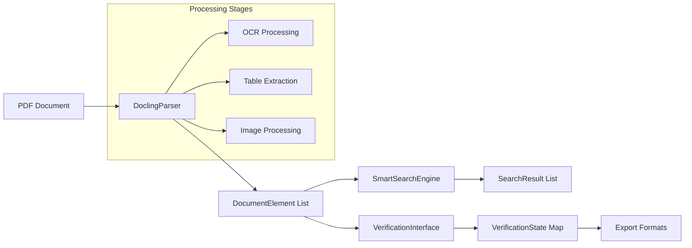
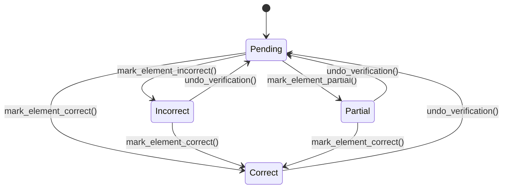

# Smart PDF Parser System Architecture Documentation

## Table of Contents

1. [System Overview](#system-overview)
2. [Architecture Explanation](#architecture-explanation)
3. [Technical Concepts](#technical-concepts)
4. [Library Dependencies Analysis](#library-dependencies-analysis)
5. [API Reference](#api-reference)
6. [Component Specifications](#component-specifications)

---

## System Overview

The Smart PDF Parser is a sophisticated document processing system built around IBM's Docling library, providing intelligent PDF parsing, multi-modal search capabilities, and interactive verification workflows. The system transforms PDF documents into structured, searchable data while maintaining spatial and contextual relationships.

### Core Design Principles

- **Docling-First Architecture**: Leverages IBM's Docling as the primary document conversion engine
- **Multi-Modal Processing**: Supports text, tables, images, and formulas with specialized handling
- **Interactive Verification**: Human-in-the-loop validation with visual overlay capabilities
- **Performance Optimization**: Intelligent caching, fallback strategies, and memory management
- **Type Safety**: Comprehensive dataclass validation and error handling

---

## Architecture Explanation

### System Components Overview



### Data Flow Architecture

The system follows a clear data transformation pipeline:



### Component Interactions

#### 1. Parser Layer (`src/core/parser.py`)

**Primary Responsibility**: PDF document conversion and element extraction

**Key Classes**:
- `DoclingParser`: Main parsing engine with configurable options
- Integrates with Docling's `DocumentConverter` and `PdfPipelineOptions`

**Integration Patterns**:
```python
# Docling Configuration
pipeline_options = PdfPipelineOptions()
pipeline_options.do_ocr = self.enable_ocr
pipeline_options.do_table_structure = self.enable_tables
pipeline_options.generate_page_images = self.generate_page_images

converter = DocumentConverter(
    format_options={
        InputFormat.PDF: PdfFormatOption(pipeline_options=pipeline_options)
    }
)
```

**Error Handling Strategy**:
- OCR fallback: Retry without OCR on OCR engine failures
- Memory management: Reduce settings for large documents
- Graceful degradation: Continue processing with simplified configurations

#### 2. Search Engine (`src/core/search.py`)

**Primary Responsibility**: Multi-modal document search with intelligent ranking

**Key Features**:
- **Exact Matching**: Normalized string containment with word-boundary awareness
- **Fuzzy Search**: Multiple algorithms (token_set_ratio, partial_ratio, WRatio) with weighted scoring
- **Semantic Search**: Extensible framework for embedding-based search (currently using enhanced fuzzy)
- **Advanced Filtering**: Type, page, spatial region, and metadata filters

**Search Architecture**:
```python
class SmartSearchEngine:
    def search(self, query: str, **filters) -> List[SearchResult]:
        # 1. Apply pre-filters (type, page, region)
        candidates = self._apply_filters(self.elements, **filters)
        
        # 2. Execute search strategies
        exact_results = self._exact_search(query, candidates)
        fuzzy_results = self._fuzzy_search(query, candidates) if enable_fuzzy else []
        
        # 3. Merge, deduplicate, and rank
        return self._merge_and_rank_results(exact_results + fuzzy_results)
```

#### 3. Verification System (`src/verification/`)

**Primary Responsibility**: Interactive validation and correction workflow

**State Management**:
- `VerificationState`: Tracks element verification status with history
- `VerificationInterface`: Manages workflow and bulk operations
- `PDFRenderer`: Provides visual overlay capabilities

**Verification Workflow**:


### Design Decisions and Rationale

#### 1. Docling Integration Strategy

**Decision**: Use Docling as the primary document conversion engine rather than building custom PDF parsing.

**Rationale**:
- **Proven Technology**: IBM's enterprise-grade document AI capabilities
- **Multi-Modal Support**: Native handling of text, tables, images, and formulas
- **OCR Integration**: Built-in support for multiple OCR engines (Tesseract, EasyOCR)
- **Continuous Improvement**: Benefits from IBM's ongoing research and development

**Implementation Pattern**:
```python
# Lazy initialization with configuration flexibility
@property
def converter(self):
    if self._converter is None:
        self._converter = self._create_converter()
    return self._converter

def _create_converter(self) -> DocumentConverter:
    # Dynamic configuration based on parser settings
    pipeline_options = PdfPipelineOptions()
    # ... configure based on instance settings
    return DocumentConverter(format_options={...})
```

#### 2. Element Type Taxonomy

**Decision**: Standardize on specific element types with intelligent classification.

**Element Types**:
- `text`: Regular paragraph content
- `heading`: Section headers and titles
- `table`: Structured tabular data
- `image`: Pictures and figures
- `formula`: Mathematical expressions
- `list`: Bulleted or numbered lists
- `caption`: Image/table captions
- `code`: Code blocks

**Classification Logic**:
```python
def _determine_text_element_type(self, text: str) -> str:
    # Heuristic-based classification with fallbacks
    if len(text) < 100 and text.isupper():
        return 'heading'
    if any(symbol in text for symbol in ['=', '∑', '∫', '√']):
        return 'formula'
    # ... additional rules
    return 'text'  # Default fallback
```

#### 3. Coordinate System Transformation

**Challenge**: Docling uses PDF coordinates (bottom-left origin) while verification rendering needs pixel coordinates (top-left origin).

**Solution**: Comprehensive bbox handling with validation and normalization.

```python
def _extract_bbox(self, item) -> Dict[str, float]:
    # Handle both new prov-based and legacy location-based approaches
    if hasattr(item, 'prov') and item.prov:
        prov_item = item.prov[0]
        bbox = prov_item.bbox
        coords = {
            'x0': float(getattr(bbox, 'l', 0)),
            'y0': float(getattr(bbox, 't', 0)),
            'x1': float(getattr(bbox, 'r', 100)),
            'y1': float(getattr(bbox, 'b', 20))
        }
    # ... fallback strategies and validation
    return coords
```

---

## Technical Concepts

### Coordinate System Transformations

The system handles two coordinate systems:

1. **PDF Coordinates**: Bottom-left origin, Y increases upward
2. **Pixel Coordinates**: Top-left origin, Y increases downward

**Transformation Strategy**:
- Parser extracts PDF coordinates from Docling
- Verification renderer transforms to pixel coordinates for overlay
- Bounding box validation ensures consistency

### Multi-Modal Search Architecture

The search system employs a multi-strategy approach:

#### Exact Search Algorithm
```python
def _calculate_exact_score(self, query_normalized: str, text_normalized: str, 
                          element: DocumentElement) -> float:
    base_score = 0.8
    
    # Complete match boost
    if query_normalized == text_normalized:
        base_score = 0.95
    
    # Word overlap analysis
    query_words = set(query_normalized.split())
    text_words = set(text_normalized.split())
    word_overlap_ratio = len(query_words.intersection(text_words)) / len(query_words)
    
    # Apply multi-factor scoring
    return self._calculate_relevance_score(element, query_normalized, 'exact', base_score)
```

#### Relevance Scoring Framework
```python
def _calculate_relevance_score(self, element: DocumentElement, query: str, 
                              match_type: str, base_score: float) -> float:
    # Element type weighting
    type_multipliers = {
        'heading': 1.3,    # Headings more important
        'table': 1.2,      # Tables contain structured data
        'text': 1.0,       # Baseline
        'image': 0.9       # Less searchable content
    }
    
    # Confidence factor
    confidence_factor = 0.8 + (element.confidence * 0.2)
    
    # Position factor (earlier pages favored)
    page_factor = 1.0 / (1.0 + (element.page_number - 1) * 0.01)
    
    return min(1.0, base_score * type_multipliers[element.element_type] * 
               confidence_factor * page_factor)
```

### Verification State Management

The verification system maintains comprehensive state tracking:

#### State Transitions
```python
@dataclass
class VerificationState:
    element_id: int
    status: str  # 'pending', 'correct', 'incorrect', 'partial'
    timestamp: datetime
    verified_by: Optional[str] = None
    correction: Optional[str] = None
    corrected_text: Optional[str] = None
    verified_at: Optional[datetime] = None
    notes: Optional[str] = None
```

#### History Tracking
```python
def _add_history_entry(self, element_id: int, action: str, user: Optional[str] = None):
    entry = {
        'action': action,
        'status': self.verification_states[element_id].status,
        'timestamp': datetime.now().isoformat(),
        'user': user,
        'metadata': metadata or {}
    }
    self._verification_history[element_id].append(entry)
```

### Error Handling Strategies

#### Graceful Degradation Pattern
```python
def parse_document(self, pdf_path: Path) -> List[DocumentElement]:
    try:
        result = self._convert_document(pdf_path)
        return self._extract_elements(result.document)
    except OCRError as e:
        if self.enable_ocr:
            logger.info("Retrying without OCR")
            return self._parse_without_ocr(pdf_path)
        raise DocumentParsingError(f"OCR processing failed: {e}")
    except MemoryError as e:
        logger.error("Insufficient memory, trying reduced settings")
        return self._parse_with_reduced_settings(pdf_path)
```

---

## Library Dependencies Analysis

### Core Dependencies

#### Primary Libraries

| Library | Version | Purpose | Integration Pattern |
|---------|---------|---------|-------------------|
| **docling** | >=1.0.0 | Document conversion engine | Core dependency, lazy initialization |
| **streamlit** | >=1.28.0 | Web UI framework | UI layer, component-based architecture |
| **pandas** | >=2.0.0 | Data manipulation | Export functionality, dataframe operations |
| **numpy** | >=1.24.0 | Numerical operations | Coordinate transformations, embeddings |

#### Text Processing Libraries

| Library | Version | Purpose | Performance Impact |
|---------|---------|---------|-------------------|
| **fuzzywuzzy** | >=0.18.0 | Fuzzy string matching | Medium - cached results |
| **python-levenshtein** | >=0.21.0 | Edit distance calculations | High performance C extension |

#### Image Processing Libraries

| Library | Version | Purpose | Memory Impact |
|---------|---------|---------|---------------|
| **pillow** | >=10.0.0 | Image manipulation | High - page image generation |
| **opencv-python** | >=4.8.0 | Advanced image processing | Medium - verification overlays |

#### OCR Integration

| Engine | Library | Language Support | Performance |
|--------|---------|------------------|-------------|
| **Tesseract** | tesserocr | 100+ languages | Fast, accurate |
| **EasyOCR** | easyocr | 80+ languages | Slower, good for complex layouts |

**OCR Language Mapping**:
```python
tesseract_to_easyocr = {
    'eng': 'en', 'fra': 'fr', 'deu': 'de', 'spa': 'es', 
    'ita': 'it', 'por': 'pt', 'rus': 'ru', 'chi_sim': 'ch_sim',
    # ... complete mapping
}
```

### Development Dependencies

#### Testing Framework
```bash
# Testing stack
pytest>=7.4.0           # Test framework
pytest-cov>=4.1.0       # Coverage reporting
pytest-mock>=3.11.0     # Mocking utilities
hypothesis>=6.82.0       # Property-based testing
```

#### Code Quality Tools
```bash
# Formatting and linting
black>=23.7.0            # Code formatting (100 char line length)
flake8>=6.0.0           # Linting
mypy>=1.5.0             # Type checking
```

#### Performance Monitoring
```bash
# Performance analysis
memory-profiler>=0.61.0  # Memory usage profiling
psutil>=5.9.0           # System resource monitoring
```

### Integration Patterns

#### Docling Integration
```python
class DoclingParser:
    def __init__(self, **config):
        self._converter = None  # Lazy initialization
        self.config = config
    
    @property
    def converter(self):
        if self._converter is None:
            self._converter = self._create_converter()
        return self._converter
    
    def _create_converter(self) -> DocumentConverter:
        pipeline_options = PdfPipelineOptions()
        # Configure based on instance settings
        return DocumentConverter(format_options={...})
```

#### OCR Engine Abstraction
```python
def _create_ocr_options(self):
    if self.ocr_engine == "tesseract":
        return TesseractOcrOptions(
            lang=self.ocr_lang,
            force_full_page_ocr=True
        )
    elif self.ocr_engine == "easyocr":
        easyocr_langs = [self.tesseract_to_easyocr.get(lang, 'en') 
                        for lang in self.ocr_lang]
        return EasyOcrOptions(lang=easyocr_langs)
```

### Performance Implications

#### Memory Management
- **Page Images**: Optional generation (configurable via `generate_page_images`)
- **Table Processing**: Can be disabled for memory-constrained environments
- **OCR Processing**: Fallback without OCR on memory errors

#### Caching Strategy
```python
class SearchCache:
    def __init__(self, max_size: int = 1000):
        self.cache = {}
        self.access_times = {}
        self.max_size = max_size
    
    def _evict_oldest(self):
        oldest_key = min(self.access_times, key=self.access_times.get)
        del self.cache[oldest_key]
        del self.access_times[oldest_key]
```

---

## API Reference

### Core Classes

#### DocumentElement
```python
@dataclass
class DocumentElement:
    """Represents a single element extracted from a PDF document."""
    
    text: str                          # Element text content
    element_type: str                  # 'text', 'heading', 'table', 'image', etc.
    page_number: int                   # 1-indexed page number
    bbox: Dict[str, float]            # {'x0', 'y0', 'x1', 'y1'}
    confidence: float                  # Extraction confidence (0.0-1.0)
    metadata: Dict[str, Any]          # Additional element metadata
    
    def __post_init__(self):
        """Validates element after initialization."""
        # Confidence validation
        if not 0.0 <= self.confidence <= 1.0:
            raise ValueError(f"Confidence must be between 0 and 1")
        
        # Page number validation
        if self.page_number < 1:
            raise ValueError(f"Page number must be >= 1")
        
        # Bounding box validation
        required_bbox_keys = {'x0', 'y0', 'x1', 'y1'}
        if not required_bbox_keys.issubset(self.bbox.keys()):
            raise ValueError(f"Missing required bbox keys")
```

#### ParsedDocument
```python
@dataclass
class ParsedDocument:
    """Complete parsed document with elements and metadata."""
    
    elements: List[DocumentElement]    # Extracted document elements
    metadata: Dict[str, Any]          # Document metadata
    pages: Optional[Dict[int, Any]]   # Page-specific data
    
    def export_to_json(self, indent: int = 2) -> str:
        """Export document to JSON format."""
        
    def export_to_markdown(self) -> str:
        """Export document to Markdown format."""
        
    def export_to_html(self) -> str:
        """Export document to HTML format."""
        
    def get_elements_by_type(self, element_type: str) -> List[DocumentElement]:
        """Get all elements of specific type."""
        
    def get_elements_by_page(self, page_number: int) -> List[DocumentElement]:
        """Get all elements from specific page."""
```

#### SearchResult
```python
@dataclass
class SearchResult:
    """Search result with relevance scoring."""
    
    element: DocumentElement           # Matching document element
    score: float                      # Relevance score (0.0-1.0)
    match_type: str                   # 'exact', 'fuzzy', 'semantic'
    matched_text: str                 # Text that matched the query
    match_context: Optional[str]      # Context around the match
    
    def __post_init__(self):
        """Validates search result after initialization."""
        if not 0.0 <= self.score <= 1.0:
            raise ValueError(f"Score must be between 0 and 1")
        
        if self.match_type not in ['exact', 'fuzzy', 'semantic']:
            raise ValueError(f"Invalid match type: {self.match_type}")
```

#### VerificationState
```python
@dataclass
class VerificationState:
    """Verification state of a document element."""
    
    element_id: int                    # Element identifier
    status: str                       # 'pending', 'correct', 'incorrect', 'partial'
    timestamp: datetime               # Last modification time
    verified_by: Optional[str]        # User who verified element
    correction: Optional[str]         # Correction text (legacy)
    corrected_text: Optional[str]     # Corrected text content
    verified_at: Optional[datetime]   # Verification completion time
    notes: Optional[str]             # Additional notes
    
    def __post_init__(self):
        """Validates verification state."""
        valid_statuses = {'pending', 'correct', 'incorrect', 'partial'}
        if self.status not in valid_statuses:
            raise ValueError(f"Invalid status: {self.status}")
```

### DoclingParser API

#### Constructor Parameters
```python
def __init__(
    self,
    enable_ocr: bool = False,                    # Enable OCR processing
    enable_tables: bool = True,                  # Enable table extraction
    generate_page_images: bool = False,          # Generate page images
    max_pages: Optional[int] = None,             # Limit processing to N pages
    ocr_engine: str = "tesseract",              # OCR engine ('tesseract', 'easyocr')
    ocr_lang: Union[str, List[str]] = "eng",    # OCR language(s)
    table_mode: TableFormerMode = TableFormerMode.ACCURATE,  # Table extraction mode
    image_scale: float = 1.0                     # Image scaling factor
):
```

#### Main Methods
```python
def parse_document(self, pdf_path: Path) -> List[DocumentElement]:
    """Parse PDF and return extracted elements.
    
    Args:
        pdf_path: Path to PDF file
        
    Returns:
        List of DocumentElement objects
        
    Raises:
        FileNotFoundError: PDF file not found
        ValueError: Invalid PDF file
        DocumentParsingError: Parsing failed
    """

def parse_document_full(self, pdf_path: Path) -> ParsedDocument:
    """Parse PDF and return full ParsedDocument with metadata.
    
    Args:
        pdf_path: Path to PDF file
        
    Returns:
        ParsedDocument with elements, metadata, and optional page images
    """

def parse_multiple_documents(self, pdf_paths: List[Path]) -> Dict[Path, List[DocumentElement]]:
    """Batch process multiple PDFs.
    
    Args:
        pdf_paths: List of PDF file paths
        
    Returns:
        Dictionary mapping paths to extracted elements
    """
```

### SmartSearchEngine API

#### Constructor
```python
def __init__(self, elements: List[DocumentElement]):
    """Initialize search engine with document elements."""
```

#### Search Methods
```python
def search(
    self,
    query: str,
    enable_fuzzy: bool = True,           # Enable fuzzy matching
    fuzzy_threshold: float = 0.8,        # Minimum fuzzy score
    element_types: Optional[List[str]] = None,     # Filter by element types
    page_numbers: Optional[List[int]] = None,      # Filter by pages
    region: Optional[Dict[str, float]] = None,     # Spatial region filter
    strict_containment: bool = False,              # Strict region containment
    include_metadata: bool = False,               # Search in metadata
    limit: Optional[int] = None,                  # Max results
    min_score: float = 0.0                       # Minimum relevance score
) -> List[SearchResult]:
    """Main search method with configurable options."""

def search_exact(self, query: str, **kwargs) -> List[SearchResult]:
    """Perform exact search only."""

def search_fuzzy(self, query: str, threshold: float = 0.8, **kwargs) -> List[SearchResult]:
    """Perform fuzzy search only."""

def search_semantic(self, query: str, **kwargs) -> List[SearchResult]:
    """Perform semantic search (enhanced fuzzy)."""
```

#### Filter Methods
```python
def filter_by_element_types(
    self, 
    elements: List[DocumentElement], 
    element_types: List[str]
) -> List[DocumentElement]:
    """Filter elements by type."""

def filter_by_pages(
    self, 
    elements: List[DocumentElement], 
    page_numbers: List[int]
) -> List[DocumentElement]:
    """Filter elements by page numbers."""

def filter_by_region(
    self, 
    elements: List[DocumentElement], 
    region: Dict[str, float],
    strict_containment: bool = False
) -> List[DocumentElement]:
    """Filter elements by spatial region."""
```

### VerificationInterface API

#### Constructor
```python
def __init__(
    self, 
    elements: List[DocumentElement], 
    renderer: Optional[PDFRenderer] = None
):
    """Initialize verification interface."""
```

#### Verification Methods
```python
def mark_element_correct(
    self, 
    element_id: int, 
    verified_by: Optional[str] = None
):
    """Mark element as verified correct."""

def mark_element_incorrect(
    self,
    element_id: int,
    correction: Optional[str] = None,
    corrected_text: Optional[str] = None,
    notes: Optional[str] = None,
    verified_by: Optional[str] = None
):
    """Mark element as incorrect with optional correction."""

def mark_element_partial(
    self,
    element_id: int,
    notes: Optional[str] = None,
    corrected_text: Optional[str] = None,
    verified_by: Optional[str] = None
):
    """Mark element as partially correct."""

def undo_verification(self, element_id: int):
    """Undo verification, return to pending state."""
```

#### State Query Methods
```python
def get_verification_summary() -> Dict[str, Union[int, float]]:
    """Get overall verification statistics."""

def get_verification_summary_by_page() -> Dict[int, Dict[str, Union[int, float]]]:
    """Get verification summary by page."""

def get_verification_summary_by_type() -> Dict[str, Dict[str, Union[int, float]]]:
    """Get verification summary by element type."""

def get_verification_progress() -> Dict[str, Union[int, float]]:
    """Get verification progress statistics."""
```

#### Export Methods
```python
def export_verification_data(
    self,
    format: str = 'json',           # 'json' or 'csv'
    corrections_only: bool = False   # Export only corrected elements
) -> str:
    """Export verification data in specified format."""

def load_verification_state(self, exported_data: str):
    """Load verification state from exported JSON data."""
```

---

## Component Specifications

### Parser Configuration Options

#### OCR Configuration
```python
class OCRConfig:
    engine: str = "tesseract"          # 'tesseract' or 'easyocr'
    languages: List[str] = ["eng"]     # Language codes
    force_full_page: bool = True       # Force OCR on entire page
    
    # Tesseract-specific
    tesseract_config: Dict[str, Any] = {
        'force_full_page_ocr': True
    }
    
    # EasyOCR-specific
    easyocr_config: Dict[str, Any] = {
        'gpu': False,                  # Use GPU acceleration
        'batch_size': 1               # Processing batch size
    }
```

#### Table Extraction Options
```python
class TableConfig:
    enabled: bool = True               # Enable table extraction
    mode: TableFormerMode = TableFormerMode.ACCURATE  # 'ACCURATE' or 'FAST'
    
    structure_options: Dict[str, Any] = {
        'do_table_structure': True,
        'table_structure_options': {
            'mode': TableFormerMode.ACCURATE
        }
    }
```

#### Image Processing Options
```python
class ImageConfig:
    generate_page_images: bool = False  # Generate page images
    image_scale: float = 1.0           # Scaling factor
    image_format: str = "PNG"          # Output format
    
    processing_options: Dict[str, Any] = {
        'images_scale': 1.0,
        'generate_page_images': False
    }
```

### Search Engine Specifications

#### Matching Algorithms

##### Exact Matching
- **Text Normalization**: Unicode normalization, case folding, punctuation removal
- **Word Boundary Awareness**: Complete word matching prioritized
- **Context Extraction**: Configurable character context around matches

##### Fuzzy Matching
- **Token Set Ratio**: Handles word order differences
- **Partial Ratio**: Finds best matching substring
- **Weighted Ratio**: Balanced approach combining multiple methods
- **Combined Scoring**: Weighted average of multiple algorithms

##### Relevance Scoring
```python
relevance_factors = {
    'element_type_multiplier': {
        'heading': 1.3,
        'title': 1.5,
        'table': 1.2,
        'formula': 1.1,
        'text': 1.0,
        'image': 0.9
    },
    'confidence_factor': lambda conf: 0.8 + (conf * 0.2),
    'page_position_factor': lambda page: 1.0 / (1.0 + (page - 1) * 0.01),
    'match_type_multiplier': {
        'exact': 1.0,
        'fuzzy': 0.85,
        'semantic': 0.9
    }
}
```

#### Filter Specifications

##### Spatial Region Filter
```python
def filter_by_region(region: Dict[str, float], strict: bool = False):
    """
    Region format: {'x0': float, 'y0': float, 'x1': float, 'y1': float}
    
    If strict=True: Element must be completely within region
    If strict=False: Element must overlap with region
    """
```

##### Element Type Filter
```python
valid_element_types = {
    'text',      # Regular paragraph text
    'heading',   # Section headers
    'table',     # Tabular data
    'image',     # Pictures and figures
    'list',      # Bulleted/numbered lists
    'formula',   # Mathematical expressions
    'caption',   # Image/table captions
    'code'       # Code blocks
}
```

### Verification System Specifications

#### State Management
```python
verification_states = {
    'pending': "Awaiting verification",
    'correct': "Verified as correct",
    'incorrect': "Marked as incorrect with correction",
    'partial': "Partially correct, needs refinement"
}
```

#### Export Format Specifications

##### JSON Export Format
```json
{
    "summary": {
        "total_elements": 150,
        "verified_elements": 120,
        "total_corrections": 15,
        "accuracy_percentage": 87.5
    },
    "by_page": {
        "1": {"total": 25, "correct": 22, "incorrect": 2, "partial": 1}
    },
    "by_type": {
        "text": {"total": 100, "correct": 85, "incorrect": 10, "partial": 5}
    },
    "export_timestamp": "2024-01-15T10:30:00Z",
    "corrections_only": false,
    "elements": [
        {
            "element_id": 0,
            "text": "Document title",
            "element_type": "heading",
            "page_number": 1,
            "confidence": 0.95,
            "bbox": {"x0": 100.0, "y0": 50.0, "x1": 400.0, "y1": 80.0},
            "metadata": {"source": "docling_text"},
            "verification_state": {
                "status": "correct",
                "timestamp": "2024-01-15T10:25:00Z",
                "verified_by": "user123",
                "correction": null,
                "notes": null
            }
        }
    ]
}
```

##### CSV Export Format
```csv
element_id,text,element_type,page_number,confidence,bbox_x0,bbox_y0,bbox_x1,bbox_y1,status,timestamp,verified_by,correction,notes
0,"Document title",heading,1,0.95,100.0,50.0,400.0,80.0,correct,2024-01-15T10:25:00Z,user123,,
1,"First paragraph",text,1,0.92,100.0,100.0,500.0,150.0,incorrect,2024-01-15T10:26:00Z,user123,"Corrected text",OCR error
```

### Performance Specifications

#### Memory Management
- **Large Document Handling**: Automatic fallback to reduced settings
- **Page Image Generation**: Optional, configurable scaling
- **Cache Management**: LRU eviction with configurable size limits

#### Processing Limits
- **File Size Limit**: 100MB default with warning
- **Page Count**: No hard limit, progress tracking for large documents
- **Element Count**: Optimized for documents with 10,000+ elements

#### Error Recovery
- **OCR Fallback**: Automatic retry without OCR on engine failures
- **Memory Fallback**: Reduce table processing and image generation
- **Graceful Degradation**: Continue processing with simplified configuration

This comprehensive documentation provides both high-level architectural understanding and detailed technical specifications for the Smart PDF Parser system, following the Diátaxis framework with clear separation between explanation and reference materials.